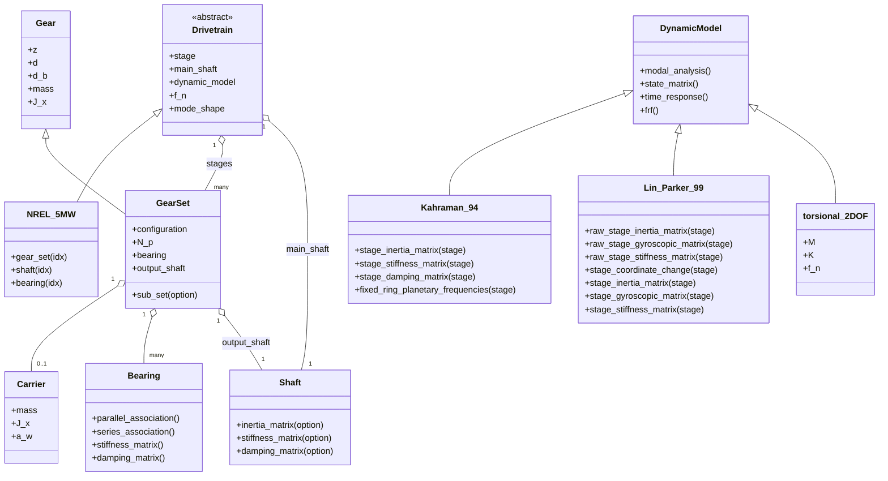
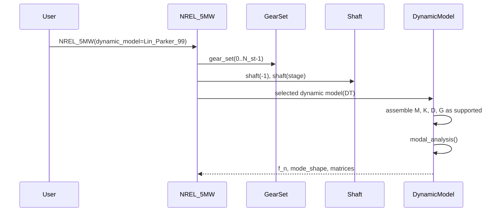
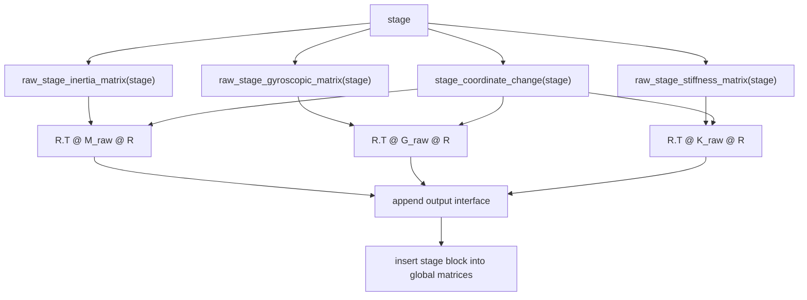
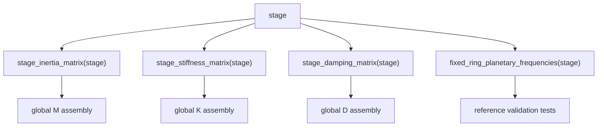
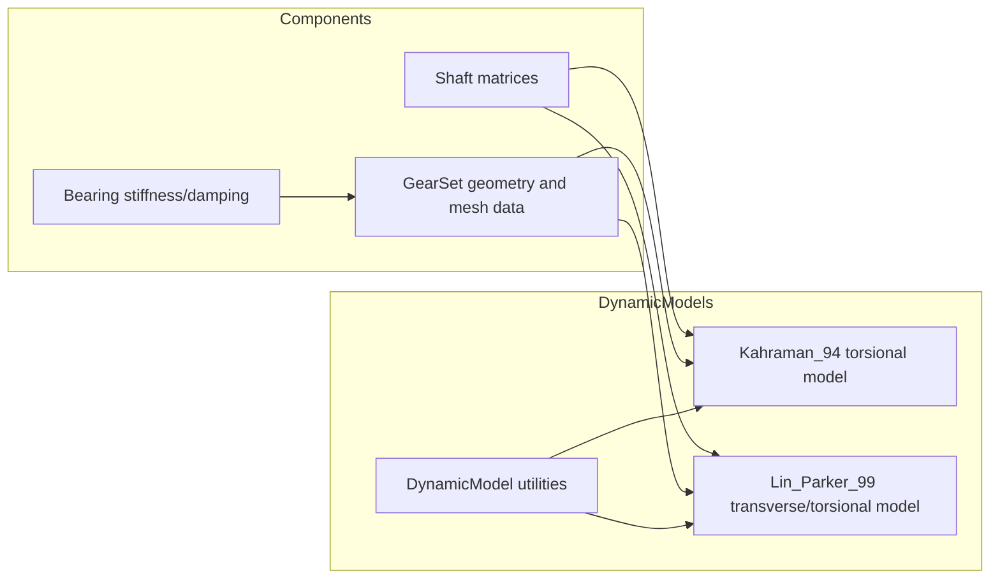

# Architecture

This document maps the main Python classes and the dynamic assembly workflows.
It is intentionally selective: the diagrams show the classes and methods that
define ownership boundaries and matrix assembly, not every available helper.

## Class Structure

## Model Construction Flow

`NREL_5MW` is a concrete drivetrain definition. It builds the component data,
then delegates dynamic matrices and modal results to the selected dynamic model.

## LP99 Stage Assembly

`Lin_Parker_99` keeps two levels of stage matrix assembly:

- raw helpers mirror the MATLAB/paper isolated-stage matrices;
- public stage helpers map those matrices into the assembled drivetrain
  coordinates and append the output interface.

## Kahraman 1994 Stage Assembly

`Kahraman_94` is a reduced torsional formulation. A planetary stage is ordered
as carrier, planets, sun, output shaft. A parallel stage is ordered as wheel,
pinion, output shaft.

## Matrix Ownership

## Notes

- Commercial-tool integrations are optional adapters and should stay outside
  the core component and dynamic model classes.
- Validation tests should prefer small deterministic fixtures, published
  reference values, or independently derived symbolic notebooks where possible.
- New dynamic formulations should document their DOF order before exposing
  stage matrix helpers.
